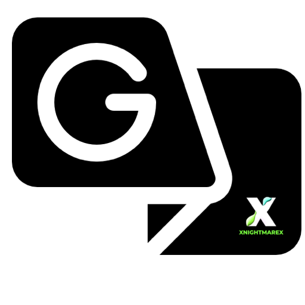

[![Reportar][issues-shield]][issues-url]
[![MIT License][license-shield]][license-url]
[![LinkedIn][linkedin-shield]][linkedin-url]

 

  

  <h3 align="center">XTraduce</h3>

  

   Traductor para barra de tareas
     
    <a href="https://github.com/marrionesa/xtraduce/releases"><strong>Descargar »</strong></a>
     
     
    <a href="https://github.com/marrionesa">Ver demo</a>
    ·
    <a href="https://github.com/marrionesa/xtraduce/issues">Reportar error</a>
    ·
    <a href="https://linkedin.com/servermatik/">Contactar</a>
  

<!-- DESPLEGABLE CONTENIDOS 

  
Tabla de contenidos

  <ol>
    <li>
      <a href="#about-the-project">Sobre XTraduce</a>
      <ul>
        <li><a href="#built-with">Built With</a></li>
      </ul>
    </li>
    <li>
      <a href="#getting-started">Getting Started</a>
      <ul>
        <li><a href="#prerequisites">Prerequisites</a></li>
        <li><a href="#installation">Installation</a></li>
      </ul>
    </li>
    <li><a href="#usage">Usage</a></li>
    <li><a href="#roadmap">Roadmap</a></li>
    <li><a href="#contributing">Contributing</a></li>
    <li><a href="#license">License</a></li>
    <li><a href="#contact">Contact</a></li>
    <li><a href="#acknowledgments">Acknowledgments</a></li>
  </ol>

-->

<!-- ABOUT THE PROJECT -->
## Sobre XTraduce

[![Product Name Screen Shot][product-screenshot]](https://example.com)

Aplicacion sencilla integrando el motor de traduccion Google Translator. 

`Caracteristicas:`
* Actualizaciones automaticas
* Programa minimizado en barra de tareas 
* Menu desplegable click derecho en icono.

`Capturas de pantalla`

  
    
 

    
    
    

## Contacto

Mario - [@marrionesa](https://twitter.com/marrionesa) - mario@servermatik.es

Project Link: [https://github.com/marrionesa/xtraduce](https://github.com/marrionesa/xtraduce)

<!-- MARKDOWN LINKS & IMAGES -->
<!-- https://www.markdownguide.org/basic-syntax/#reference-style-links -->
[contributors-shield]: https://img.shields.io/github/contributors/marrionesa/Best-README-Template.svg?style=for-the-badge
[contributors-url]: https://github.com/marrionesa/Best-README-Template/graphs/contributors
[forks-shield]: https://img.shields.io/github/forks/marrionesa/Best-README-Template.svg?style=for-the-badge
[forks-url]: https://github.com/marrionesa/Best-README-Template/network/members
[stars-shield]: https://img.shields.io/github/stars/marrionesa/Best-README-Template.svg?style=for-the-badge
[releases]: https://github.com/marrionesa/xtraduce/releases
[issues-shield]: https://img.shields.io/github/issues/marrionesa/Best-README-Template.svg?style=for-the-badge
[issues-url]: https://github.com/marrionesa/Best-README-Template/issues
[license-shield]: https://img.shields.io/github/license/marrionesa/Best-README-Template.svg?style=for-the-badge
[license-url]: https://github.com/marrionesa/
[linkedin-shield]: https://img.shields.io/badge/-LinkedIn-black.svg?style=for-the-badge&logo=linkedin&colorB=555
[linkedin-url]: https://linkedin.com/in/marrionesa
[product-screenshot]: XTraduce.gif
